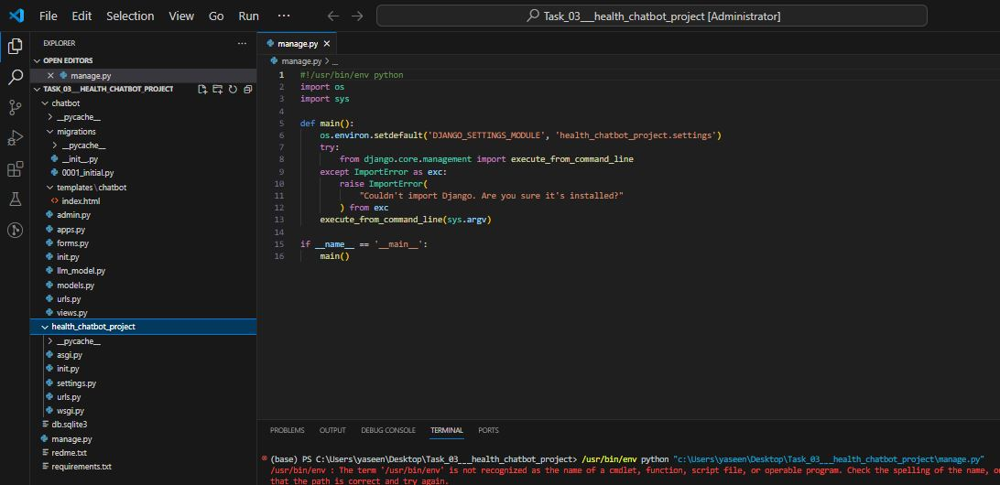
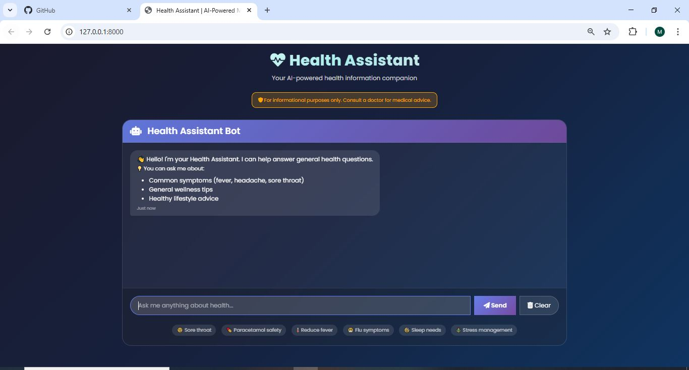
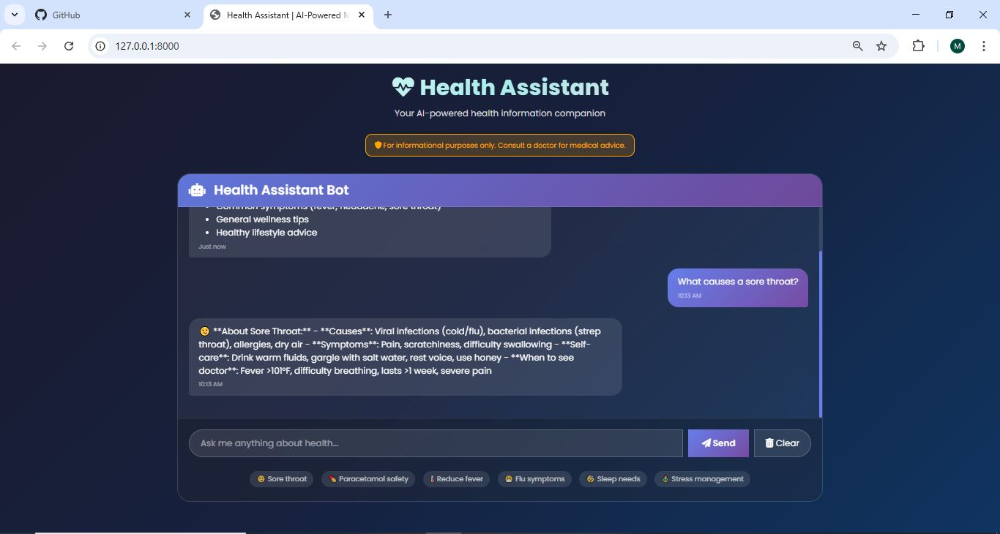
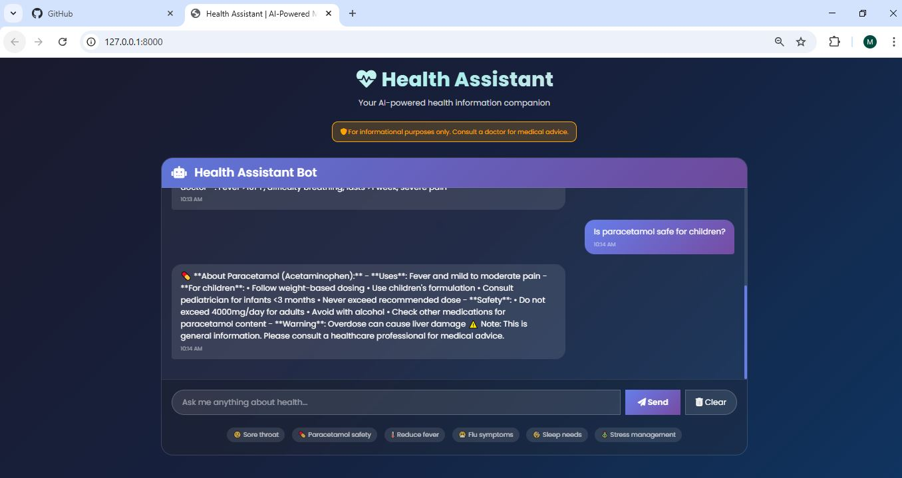
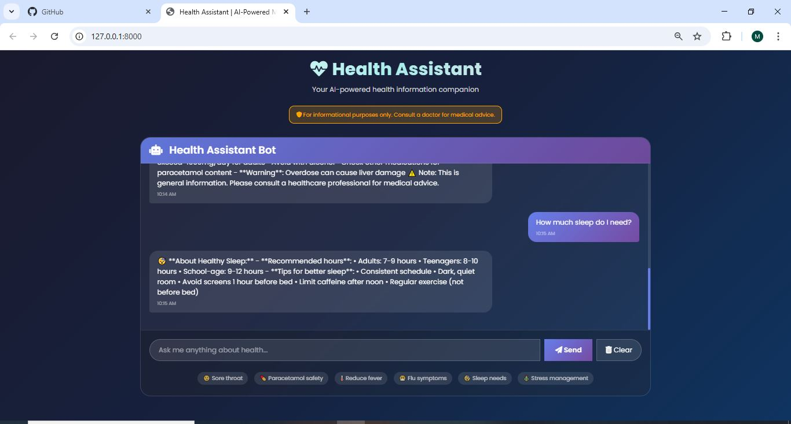

# 💊 Health Assistant Chatbot - AI-Powered Medical Information System

[](https://www.python.org/)
[](https://www.djangoproject.com/)
[](LICENSE)

A friendly and helpful health information chatbot that answers general health-related questions using prompt engineering and rule-based responses. Built with Django, this application provides safe, informative, and empathetic health guidance.

---

## 📸 Project Screenshots

### 🗂️ Project Structure
The complete project structure for better understanding.



### 🖥️ Main Chat Interface
The main dashboard where users can ask health-related questions.



### 💬 Chat Conversation - Example 1
Sample interaction showing the chatbot's helpful responses.



### 💬 Chat Conversation - Example 2
Additional conversation demonstrating the chatbot's capabilities.



### 💬 Chat Conversation - Example 3
More examples of health information responses.



---

## 📊 Project Overview

This project creates an intelligent health information chatbot that:
- Answers general health-related questions
- Uses prompt engineering for friendly, clear responses
- Implements safety filters to avoid harmful advice
- Provides medical disclaimers
- Offers crisis helpline information for emergencies

The chatbot covers topics including symptoms, common illnesses, medications, wellness, children's health, and mental health.

---

## 🎯 Features

### ✅ Core Functionality
- **Health Information**: Answers questions about symptoms, illnesses, and wellness
- **Safety Filters**: Detects dangerous queries and provides crisis resources
- **Medical Disclaimer**: Always advises consulting healthcare professionals
- **Chat History**: Stores conversation history in database
- **Clear History**: Option to clear chat history

### ✅ Topics Covered
| Category | Topics |
|----------|--------|
| **Symptoms** | Sore throat, fever, headache, stomach pain |
| **Common Illnesses** | Cold, flu, allergies |
| **Medications** | Paracetamol, Ibuprofen safety information |
| **Wellness** | Sleep, stress, exercise, hydration |
| **Children's Health** | Fever, cough, nutrition, vaccinations |
| **Mental Health** | Depression, anxiety, crisis support |

### ✅ Safety Features
- Dangerous keyword detection
- Crisis helpline information (988)
- Medical disclaimer on all responses
- No diagnosis or treatment advice
- Emergency resources

---

## 🚀 Installation & Setup

### Prerequisites
- Python 3.9 or higher
- pip package manager

### Step 1: Clone the Repository
```bash
git clone https://github.com/yourusername/health-chatbot-project.git
cd health-chatbot-project
